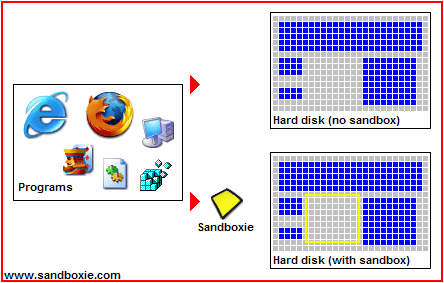

# Sandboxie Pro

<strong>[Sandboxie](https://sandboxie-plus.com/Sandboxie)</strong> 是一款适用于 32 位和 64 位 Windows NT 操作系统的沙盒隔离软件。自开源以来由 David Xanatos 持续开发，此前由 Sophos 开发（Sophos 从 Invincea 收购，Invincea 更早从原作者 Ronen Tzur 处收购）。它创建了一个类沙盒的隔离操作环境，应用程序可在其中运行或安装，而不会永久修改本地或映射驱动器。隔离的虚拟环境可用于对不受信任的程序和网页浏览进行受控测试。

自开源后，Sandboxie 以两种形式发布：经典版（基于 <strong>[MFC](https://en.wikipedia.org/wiki/Microsoft_Foundation_Class_Library)</strong> 的界面）和 Plus 版（包含全新功能及基于 <strong>[Q't](https://www.qt.io/)</strong> 的全新界面）。所有新功能均优先面向 Plus 分支，但通常也可通过手动编辑 sandboxie.ini 文件在经典版中使用。

完整的经典版文档存档可通过 <strong>[支持页面索引](https://sandboxie-plus.com/allpages)</strong> 查阅，也可直接从 <strong>[帮助主题](https://sandboxie-plus.com/sandboxie/helptopics/)</strong> 概览开始。